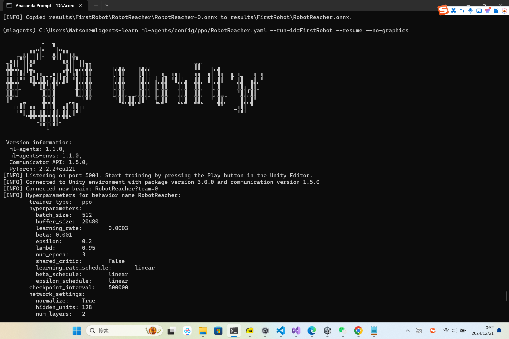
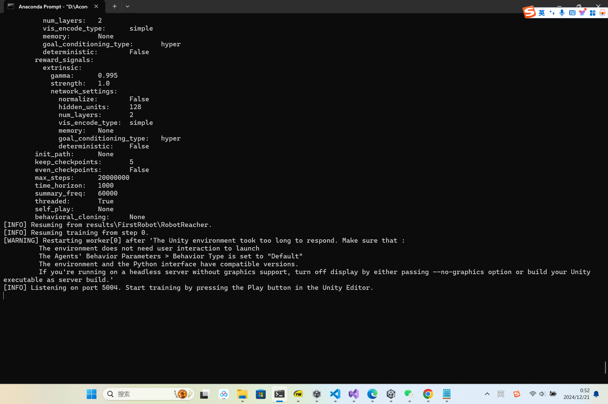
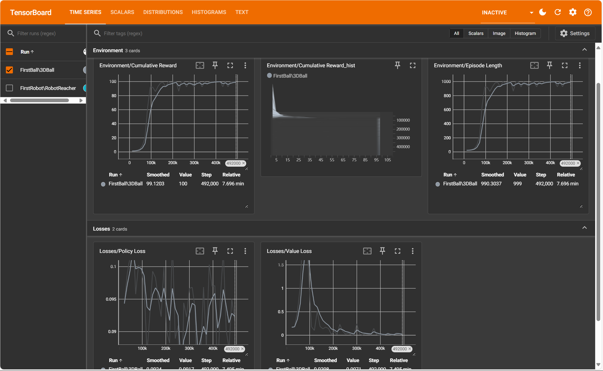
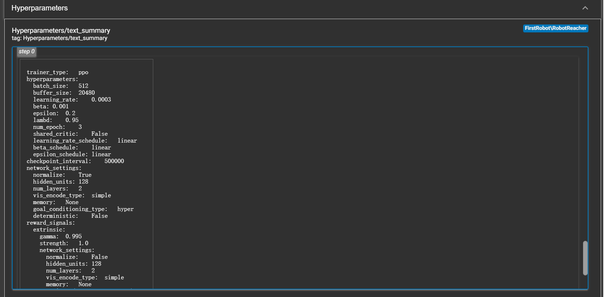

# Phase 1 Setup the model with configurable joints

1. 首先新建一个Project,在asset下新建一个model文件夹，把准备好的机械臂模型导进去,这里我使用的是test.fbx,是一个五自由度机械臂模型。根据需要设置一些meterial，设置好模型的父子关系。
2. 连接关节实体。利用configurable joint组建。但是在这里我遇到问题。我参考视频中的设置，但在play模式下机械臂仍然会任意方向移动。即使rigidbody中限制了机械臂的位置信息，该问题目前还在解决当中。。。

- 已解决。关节在设置Rigidbody时，取消勾选重力，同时不需要在运动学打钩。跟着教程走就行。

3. 实体关节已连接，在soildworks首先设置好每个关节的局部坐标轴。模型导为fbx文件时依然可以有关节局部坐标的信息。设置好局部坐标后，configurable joints中用于确定旋转的anchor就很好标定了。涉及到每个关节旋转的限制，并不好在组建中直接配置。希望后面能在cs文件中实现。

# Phase 2  Setup Goal behaviour 
1. 更新目标红色小球位置，使目标在一定高度区间内随机出现，每次训练结束更新位置。
2. 当检测到机械臂末端hand接触到目标小球Goal，则场景中出现蓝色小球指示机械臂抓取到目标。
3. 编写cs脚本控制小球运动。[ReacherGoal.cs](./Scrips/ReacherGoal.cs)

# Phase 3 Script MLAgent for robot arm
1. 编写cs脚本控制机械臂运动[ReachRobot.cs](./Scrips/ReachRobot.cs)
2. 当hand靠近goal时，给一个较小的reward；当hand碰到goal时，给一个较大的reward.
3. 当hand与障碍物发生碰撞时，结束本次训练，进入下一次。

# Phase 4 Training
打开anaconda Prompt
激活Mlagents环境`conda activate mlagents`
导航到ml-agents的安装目录下。运行`mlagents-learn ml-agents/config/ppo/RobotReacher.yaml --run-id=FirstRobot--resume`

# Phase 5 
[pre-Training video](./image/RoboticsTraining.mp4)
### 训练开展遇到问题。响应时间过长

### 可能原因：
1. 该机械臂训练变量空间共有72个，有5组连续动作的向量。模型复杂度比较高，但我无法使用GPU进行训练（没有显卡）因此可能导致响应时间过长。
2. 可能存在MLagents包与python依赖版本不兼容。但是用同样的配置从零开始训练示例模型却能够很好的训练。从这个角度来看，也许不是不兼容的问题。

**正常训练信息**

**异常训练信息**
